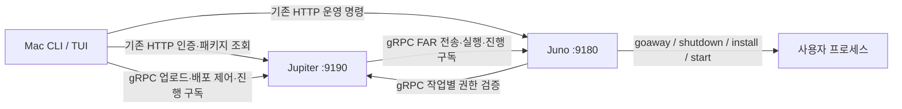

# 신규 배포 기능 사용 및 검증

관련 프로젝트의 작업 브랜치는 모두 `feature/progressive-deploy`이다.
기존 HTTP 라우트, 요청/응답 형식, 업무 핸들러는 유지한다. 새 기능은 `rodeploy`
TUI와 별도 `fatima.opm.v2` API가 담당한다. 다른 운영 명령은 기존 HTTP 경로를 쓴다.

## 호출 구조



9190/9180은 기본값이며 기존 설정 포트를 그대로 사용한다. HTTP/1.1은 기존 서버,
HTTP/2 연결은 native gRPC 서버가 처리한다. 별도 공개 포트나 HTTP Upgrade 왕복은 없다.
신규 기능 확인은 `GET /.well-known/fatima/capabilities`와 gRPC Discovery로 한다.
HTTP/2 연결 성공만으로 신규 기능을 판정하지 않는다.

업로드는 client streaming, 진행 구독은 server streaming, 실행/승인/조회는 unary RPC다.
Jupiter는 Juno의 세부 goaway/설치 구현을 이해하지 않고, 작업 상태와 이벤트를 전달한다.

## 사용 흐름

```sh
rocontext use local
rodeploy
# 파일 경로가 미리 정해졌다면
rodeploy upload /absolute/path/example.far
# 같은 화면을 여는 단축 형식
rodeploy /absolute/path/example.far
```

1. `u`: 로컬 FAR 목록에서 선택하고 내용을 확인한 뒤 `Enter`로 업로드한다.
   gofar와 동일하게 **첫 번째 GOPATH의 `far/<process>/*.far`**를 읽어 파일 수정 시각이
   최근인 순서로 표시한다. 같은 이름으로 다시 빌드한 파일도 최신순으로 정렬한다.
   `p`로 경로를 직접 입력할 수 있고 `r`로 목록을 갱신한다. 경로 입력 중 `Enter`는
   파일 확인까지만 수행하며, 다음 `Enter`가 실제 업로드다. 인자로 FAR를 주면 해당 경로와
   파일 정보가 미리 선택된 Upload 화면이 열린다. 자동 업로드하지 않는다.
2. Artifact 목록의 마지막 열과 상세의 `등록 시간`은 Jupiter에 업로드가 확정된 시각이다.
   **CLI가 실행되는 PC의 로컬 시간대**로 `2026-09-08 17:52:19` 형식을 사용한다.
   TTL 카운트다운 대신 등록 시간을 표시하며, 원본 24시간 보관 정책은 그대로다.
   빌드 시각·사용자·브랜치·커밋·메시지·저장소는 별도 항목으로 표시하고 `i`로 전체 ID와
   SHA-256을 펼친다. 만료된 항목은 `EXPIRED`로 표시하고 새 배포를 차단한다.
3. `Enter`: 패키지 그룹 안에서 첫 번째 패키지를 선택하고 배포 계획 확인.
4. 첫 패키지에 배포 후 `WAITING`. 프로세스 기동 확인과 실제 서비스 상태 확인을 구분한다.
5. `c`: 서비스 상태를 확인한 운영자가 나머지 배포 승인. 같은 원본 FAR로 순차 배포한다.
6. `l`: 저장된 rollout 목록. 선택하면 진행 상황에 다시 연결한다.

모든 화면은 C안의 공통 구조를 사용한다. 상단은 rocontext 이름·주소와 현재 단계,
왼쪽은 Upload부터 Remaining까지의 단계 목록, 오른쪽은 선택 목록과 상세 패널,
하단은 상태와 단축키다. 정상 흐름에는 Connection 단계를 표시하지 않는다.
기본 실행은 업로드된 artifact 목록을 열며 `u`로 Upload 화면에 들어간다.
`Tab`은 목록/상세 영역 전환, `↑↓`는 해당 영역의 선택/스크롤, `PgUp/PgDn`은 상세 스크롤이다.
로컬 FAR와 서버 artifact 목록은 한 번에 최대 5개를 표시한다. `↑↓`로 더 오래된 항목까지
이동할 수 있고, 목록 제목에는 현재 표시 범위와 전체 개수(예: `1–5 / 35`)가 나온다.
터미널이 60열×19행보다 작으면 크기 안내를 표시하고 실행 키를 받지 않는다.

`q`는 화면만 닫는다. 서버 작업은 계속된다. `f`는 현재 패키지의 최신 이벤트 따라가기다.
`r`은 불확실한 작업의 재조회 또는
실패한 패키지의 명시적 재시도이며, `x`는 이후 패키지 배포 중단이다.
이미 Juno가 접수한 작업을 강제로 종료하지 않는다. 대상이 하나면 승인 대기 없이 완료한다.

최초 접속·인증·설정 오류는 같은 프레임의 Connection 화면에 표시한다. `d`는 상세 원인,
`r`은 rocontext를 다시 읽고 재시도, `q`는 오류 요약을 stderr에 남기고 exit 1로 종료한다.
재시도 성공 시 처음 요청한 화면과 FAR 경로로 돌아간다. 비밀번호는 진단 로그에 노출하지 않는다.
`rodeploy -d`는 오류 상세를 처음부터 펼친다. 네트워크/인증 실패를 legacy로 바꾸거나
업로드/배포를 자동 실행하지 않는다.

명령줄 자동화용 JSON 모드도 제공한다. 플래그는 하위 명령 앞에 둔다.

```sh
rodeploy --json --request-id upload-001 upload ./example.far
rodeploy --json artifacts
rodeploy --json --request-id rollout-001 --artifact a_ID -g backend01 -p host01:default create
rodeploy --json watch r_ID
rodeploy --json --action continue --revision 42 act r_ID
rodeploy --json rollouts
```

JSON 모드의 `watch`는 현재 스냅샷 한 번을 출력한다. 지속 구독은 TUI의 `watch r_ID`다.
업로드/계획 생성의 응답이 유실되면 같은 request ID와 동일한 입력으로 재조회한다.
다른 입력에 같은 ID를 재사용하면 거부한다. 재시도는 이전 시도와 실패 기록을 보존한다.

## 호환성과 보호 범위

| 조합 | 동작 |
|---|---|
| 기존 CLI + 기존/신규 서버 | 기존 HTTP 기능 |
| 신규 CLI + 기존 Jupiter | legacy TUI 또는 기존 비대화형 HTTP 배포 |
| 신규 Jupiter + 기존 Juno 포함 그룹 | 배포 제출 전에 legacy TUI로 전환 |
| 모두 신규 | artifact/rollout/단계별 진행/재접속 |
| 인증·네트워크·신규 저장소 오류 | 오류 표시. 자동 legacy 재배포 금지 |

`rodeploy --legacy [기존 옵션] FAR`로 기존 명령을 명시적으로 실행할 수도 있다.
Legacy 화면에는 실제 업로드 로그와 Jupiter의 응답을 유지하며, 실행 중에는 주황색
`RUNNING / 배포 요청 진행 중`, 정상 완료 응답 후에는 초록색 `COMPLETED / 배포 요청 완료`를
상단·본문 제목·상태 바에 고정 표시한다. 응답의 대상 수도 함께 표시한다.
실패는 빨간색 `FAILED`, 명령은 종료됐지만 알려진 완료 응답이 없으면 주황색 `UNCONFIRMED`다.
기존 명령은 실패해도 exit 0일 수 있어 종료 코드와 최종 응답을 함께 확인한다.
로그는 `↑↓`로 확인하고 `f`로 최신 로그를 따라간다. 종료 후 `n`으로 새 배포를 준비하고
`q`로 화면을 닫는다. 결과 화면의 `Enter`는 재배포하지 않는다.
`enqueued`는 Juno의 설치·기동 성공을 의미하지 않으므로 내부 단계 완료를 만들어서
표시하지 않는다. 실제 설치·기동 결과는 `rodis`와 프로세스 로그에서 확인한다.

신규 저장소 초기화가 실패해도 기존 HTTP 서빙은 유지한다. 신규 capability는
`unavailable`로 표시하며, 신규 CLI는 이를 구형 서버로 오인해서 배포하지 않는다.

신규 rollout은 원본 artifact ID/SHA-256, 대상 패키지 ID와 순서를 고정한다.
같은 그룹/프로세스에 진행 중인 신규 rollout은 하나만 허용한다. 첫 패키지 이후
다음 패키지를 실행하기 전에 이전 성공 패키지의 리비전과 파일 해시를 확인한다.
기존 CLI의 동작을 바꾸지 않으므로 legacy 배포/수동 수정까지 차단하지는 않는다.

FAR 원본은 변경하지 않는다. 기존 gofar의 `/deployment.json`, `/platform/...` 형태는
가상 패키지 루트로 해석하고, 경로 탈출·중복 경로·링크·잘못된 플랫폼은 검증에서 거부한다.
Juno는 파일 검증과 실행파일 형식 확인을 기존 프로세스 중단보다 먼저 수행한다.

## 실행·보관·복구

- Jupiter 업로드 원본의 논리적 만료는 업로드 확정 후 **24시간**이다. 사용·대기로 연장하지 않는다.
  실행 중인 Jupiter는 1초 주기로 만료 파일을 제거한다. 중지 중 만료된 파일은 재기동 후 제거한다.
  메타데이터와 결과 기록은 남는다. 중단된 업로드의 임시 파일도 정리한다.
- 신규 dispatch와 나머지 승인에는 최소 30분의 잔여 시간이 필요하다.
  Juno에 검증까지 끝나서 완전히 staging된 작업은 만료 후에도 실행을 끝낼 수 있다.
- Juno는 최대 30분의 작업 예산을 둔다. IPC goaway 완료 대기 31초,
  SIGTERM 후 종료 확인 120초, 기동 후 생존 확인 3초를 사용한다.
  생존 확인은 서비스별 readiness/health check를 대신하지 않는다.
- 구형 사용자 프로세스가 IPC를 지원하지 않으면 기존 SIGUSR1 경로와 31초 grace window를
  사용하고, 완료 응답을 받을 수 없다는 사실을 표시한다.
- 실패/불확실한 결과에서는 나머지 패키지를 진행하지 않는다. Juno 재기동 시 진행 중이던
  신규 작업은 `INTERRUPTED`로 기록한다. 자동으로 같은 배포를 다시 실행하지 않는다.
  기존 프로세스 모니터/부팅 정책은 그대로이므로 실제 프로세스 상태를 확인한 뒤 재시도한다.
- 현재 신규 실행 대상은 패키지에 등록된 일반 사용자 프로세스다. OPM 자체 갱신과 외부
  실행 경로를 쓰는 프로세스는 기존 업데이트/운영 경로를 이용한다.

Jupiter 저장 경로 기본값은 `$FATIMA_HOME/data/jupiter/deployment-v2`,
Juno는 `$FATIMA_HOME/data/juno/deployment-v2`이다. `deployment.v2.storage`로 지정할 수 있다.
동작 기록은 atomic rename/fsync/flock으로 저장한다. 여러 Jupiter를 운영한다면 같은
서명 키·artifact·rollout 저장소를 공유하고, 실행 lease로 작업 소유자를 정한다.
공유 파일시스템은 flock/atomic rename을 실제로 지원해야 한다. 등록 패키지 조회도 각
Jupiter에서 완전한 정보를 제공해야 하며, 기존 registry/LB 구성은 자동 변경하지 않는다.

## 로컬 빌드와 설치

공개 저장소에 push하지 않고 형제 프로젝트의 현재 작업 파일로 빌드한다.

```sh
cd ../fatima-download
./build-local --os darwin --arch arm64

cd ../fatima-package
python3 scripts/install-local.py ../fatima-download/fatima-package.darwin-arm64.tar.gz --restart
```

초기 설치에는 `--initialize`를 추가한다. 일반 업데이트는 명령어와 설치된 OPM 바이너리를
교체하고 기존 설정을 보존한다. `--restart`는 stopro 후 종료를 기다리고 설치한 뒤 startro한다.
`packing-info.json`에는 사용한 소스의 commit, branch, dirty 상태, 파일 해시가 남는다.
기존 GitHub 기반 `build_fatima`와 `roupdate`는 수정하지 않았다.

공통 core/proto가 아직 공개 버전으로 발행되지 않았으므로 직접 개발할 때에는
`GOWORK=/absolute/path/fatima-package/go.work.dev`를 설정한다. 로컬 빌더는 이를 자동 처리한다.
릴리스 시 core 버전 발행과 각 프로젝트의 module 버전 갱신을 함께 진행해야 한다.

## 검증

```sh
./scripts/test-local.sh
```

신규 경로에는 race detector를 적용했다. 같은 포트의 HTTP/gRPC 공존, 스트림 종료와
재접속, 3개 대상의 첫 배포 승인 대기, 순차 실행, 실패 후 중단/재시도, 중복 요청,
만료 및 파일 삭제, 공유 저장소를 쓰는 두 Jupiter, Juno 재기동, 권한 범위를 검증한다.

2026-09-09 Mac에서는 생성한 Darwin ARM64 tar.gz를 실제 FATIMA_HOME에 설치하여
기존 rocontext/ropack/rodis, TUI 업로드·선택·실시간 배포, 실제 gofar 3개 플랫폼 FAR의
검증·goaway·shutdown·설치·기동·재조회까지 실행했다. 로컬 알림은 비활성화했다.

2026-09-10에는 C안의 공통 화면, 첫 GOPATH의 실제 FAR 35개 목록, 직접 경로 입력과
인자 기본값, 업로드 후 등록 시각, 대상 선택·확인·진행·이력 화면을 실제 PTY에서 확인했다.
로컬 `dpv2`를 다시 배포해 goaway·shutdown·install·start 완료를 확인했다.
60×19부터 132×42까지 화면 경계와 등록 시각 표시를 검증했으며, 접속 거부·인증 거부·
손상된 비밀번호 설정은 오류 화면과 exit 1, 재시도 성공은 원래 Upload 화면과 exit 0을
확인했다. CLI 전체 테스트, 신규 TUI race 테스트와 배포 통합 테스트가 통과했다.
실행 결과와 터미널 화면 캡처는 `.local/progressive-deploy/ui-checks`에 있다.
Legacy 결과 표시에는 기존 로그를 재생하는 PTY fixture로 정상 응답(대상 3개),
exit 0인 HTTP 실패, 알 수 없는 응답을 각각 확인했다. 완료 문구는 스크롤·크기 변경에도
남고, 결과 화면의 Enter는 배포를 다시 실행하지 않는다.

Linux ARM64에서는 컨테이너 4개(Jupiter 1개, Juno 3개)로 동일 FAR를 한 번만 올리고
첫 패키지 승인 대기 후 나머지 배포를 두 번 수행했다. 두 번째 배포는 실제 IPC drain과
종료/재기동을 포함한다. 추가 호스트 포트 개방 없이 내부 네트워크의 9190/9180을 사용했다.
구형 tar.gz에서 추출한 CLI/OPM으로 호환성 조합도 확인했다.
Jupiter/Juno 각각의 신규 저장 경로를 의도적으로 사용할 수 없게 만든 경우에도
기존 패키지 등록·ropack·rodis는 동작했고, 신규 CLI는 배포 제출을 차단했다.

전체 기존 테스트 중 `fatima-core/ipc/TestCronExecuteOnyJobName`은 IPC 환경 초기화가
없어 panic한다. 수정 전 HEAD를 별도 추출한 소스에서도 같은 오류를 재현했다.
기존 코드 보존 범위를 지키기 위해 이 테스트/IPC 코드는 수정하지 않았다.
Saturn의 기존 2분 대기 테스트는 5분 제한으로 별도 실행하여 통과했다.

공유 네트워크 파일시스템의 장애/성능, 실제 운영 LB/VPN 경로의 장시간 스트림은
로컬 검증 범위 밖이다. Linux/Darwin AMD64 tar.gz는 교차 빌드이며 실제 실행 검증은
ARM64에서 진행했다. 테스트 도구는 `scripts/`, 이번 실행의 FAR·구형 바이너리·결과는
`.local/progressive-deploy`에 있다. `test-linux.py`, `test-compatibility.py`,
`test-storage-failure.py`는 이 로컬 fixture와 `fatima-v2-local` Docker 이미지를 사용한다.
